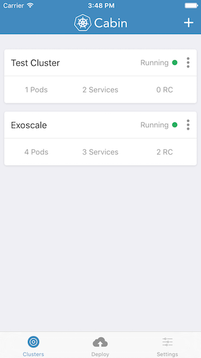
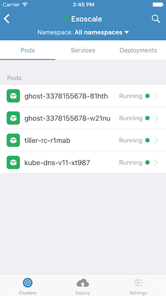
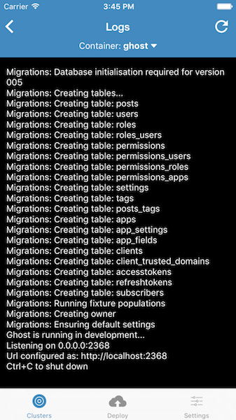

Issues for Cabin
================

Kubernetes Cabin is a Mobile App for Kubernetes.

It is currently in private testing. Email info at skippbox dot com to get early access.

Use this repository to leave any issues you might face.

Features Overview
-----------------

* Add k8s clusters with token or basic auth authentication.
* Swipe left to edit or delete entities
* Swipe down to refresh lists
* Mark Nodes as unschedulable
* Put Nodes in Maintenance mode
* Remove and add labels
* Query by labels
* Create basic deployments with single image
* Scale deployments
* Basic rolling update by changing the image only.
* Expose deployment via a service
* Access logs in multiple containers
* Exec commands in containers
* Set view based on namespaces
* Configure list of Objects you want to see
* Access complete YAML of objects
* Switch services type
* Edit service ports
* Open NodePort service in browser

WIP
---

* Add Helm stores in Settings
* View Charts in stores
* Deploy apps via Helm (none not to work)

Screenshots
-----------

You can add multiple clusters

You can view all your Kubernetes objects

You can even access logs of running pods:

